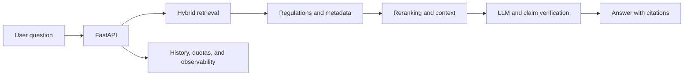

# KerjaPedia AI

**An Indonesian employment law assistant that makes every answer traceable to its source.**

KerjaPedia AI is an AI engineering and web development portfolio project. People can ask questions in everyday language, then inspect the regulation, article, clause, and page behind each answer. The project focuses on making legal question answering useful even when documents are long, the conversation changes direction, or the available sources cannot support an answer.

Deploy : [https://kerjapedia-ai.vercel.app/](https://kerjapedia-ai.vercel.app/)

## The problem

Indonesian employment rules are spread across many documents, and newer regulations can amend earlier ones. Keyword search alone may miss the relevant article. An AI answer can also sound convincing while leaving the user unable to check its legal basis.

KerjaPedia AI connects official document search with a conversational interface. Someone can ask, “Are fixed-term employees entitled to compensation?”, read the answer, and open its citations to assess the legal context.

## Product experience

| User need                                             | Implementation                                                                                                              |
| ----------------------------------------------------- | --------------------------------------------------------------------------------------------------------------------------- |
| Understand a rule without reading an entire PDF first | Chat summarizes retrieved passages and shows citations                                                                      |
| Check the basis for an answer                         | Regulation, article, clause, page, and source links appear alongside the answer                                             |
| Ask a follow-up question                              | Recent turns and a structured conversation summary help preserve context; ambiguous references are handled without guessing |
| Choose the level of detail                            | Fast, standard, and deep chat modes                                                                                         |
| Stop an answer that is no longer needed               | Cancellation travels from the browser to the provider request                                                               |
| Use personal context                                  | Signed-in users can enable personalized mode and provide a work profile                                                     |
| Explore beyond chat                                   | Document search, calculators, CV review, and compliance pages                                                               |
| Monitor quality                                       | Admin views for documents, ingestion, evaluation, feedback, token usage, and observability                                  |

The interface supports Indonesian and English. Guests can continue their conversations after signing in.

## From question to cited answer



The ingestion pipeline extracts regulation structure and document metadata before adding searchable passages to the index. During a chat, retrieval finds candidate passages, builds context, and passes it to the answer generator. Guardrails check whether claims are supported and allow the system to refuse an answer when the documents are insufficient. Conversation summaries help interpret follow-up questions, but they are never treated as legal sources.

## Engineering decisions

- **Legal structure in retrieval.** Chunks and metadata retain the regulation's identity, article, clause, page, and status. Search combines dense and sparse signals, then reranks the results.
- **Auditable answers.** Answers carry citations. Evaluation covers retrieval, claim support, refusal, and language across follow-up and bilingual cases.
- **Long conversation handling.** Structured summaries include only completed turns that pass guardrails and contain citations. Failed and cancelled turns stay out of memory.
- **Provider-level cancellation.** Abort signals pass through the Next.js proxy and API to the provider transport. Cancelled requests are recorded without saving partial answers.
- **Request observability.** Metrics are separated by fast, standard, and deep modes and include time to first status, time to first content, total latency, tokens, retries, disconnects, and provider failures.

## Stack

| Layer                     | Technology and role                                            |
| ------------------------- | -------------------------------------------------------------- |
| Web                       | Next.js 16, React 19, TypeScript                               |
| API                       | FastAPI, Python 3.12, Alembic                                  |
| Relational data           | PostgreSQL                                                     |
| Documents                 | Supabase Storage                                               |
| Retrieval                 | Upstash Vector hybrid                                          |
| Cache and background jobs | Redis, Celery                                                  |
| Answer models             | Groq or OpenRouter                                             |
| Testing                   | Pytest, Ruff, Node-based web tests, Playwright, GitHub Actions |

The main applications live in `apps/web/` and `apps/api/`. `dataset/` contains regulation materials, `evaluation/` contains evaluation materials, and `docs/` covers the architecture and pipelines in more detail.

## Verification

CI runs web lint and build, unit tests, integration tests, Playwright, API lint, database migration upgrade and downgrade checks, and pytest. The repository also provides an isolated PostgreSQL test database through `scripts/test_api.ps1`.

The seed question dataset in this repository is still marked `needs_human_review`. Quality targets in the PRD and evaluation documentation are criteria to verify, not production performance claims.

<details>
<summary>Run locally</summary>

Use Node.js 22, Python 3.12, and PostgreSQL reachable through `DATABASE_URL`. Copy `.env.example` to `.env`, then fill in the database connection and credentials for the services you use. `compose.yaml` provides local Redis.

```powershell
docker compose up -d redis
cd apps/api
python -m venv .venv
.\.venv\Scripts\python -m pip install -r requirements-dev.txt
.\.venv\Scripts\python -m alembic upgrade head
.\.venv\Scripts\python -m uvicorn app.main:app --reload
```

In another terminal:

```powershell
cd apps/web
npm ci
npm run dev
```

Open `http://localhost:3000`. API documentation is available at `http://127.0.0.1:8000/docs`. If the API reports an outdated database schema, run `python -m alembic upgrade head` with the same `DATABASE_URL` used by the API process.

</details>

KerjaPedia AI helps people find and understand regulatory information. For legal or employment decisions, check the cited regulations and consult a qualified professional or relevant authority.
