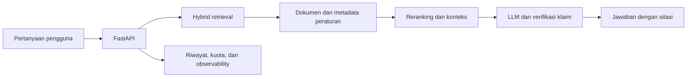

# KerjaPedia AI

**Asisten regulasi ketenagakerjaan Indonesia dengan jawaban yang bisa ditelusuri ke sumbernya.**

KerjaPedia AI adalah proyek portofolio AI engineering dan pengembangan web. Pengguna dapat bertanya dengan bahasa sehari-hari, lalu memeriksa dokumen, pasal, ayat, dan halaman yang mendasari jawaban. Fokus proyek ini adalah membangun pengalaman tanya jawab yang tetap berguna ketika dokumen hukum panjang, topik berubah, atau sumber tidak cukup untuk menjawab.

Deploy : [https://kerjapedia-ai.vercel.app/](https://kerjapedia-ai.vercel.app/)

## Masalah yang diangkat

Aturan ketenagakerjaan tersebar di banyak dokumen dan dapat diubah oleh peraturan yang lebih baru. Mencari kata kunci saja sering belum cukup untuk menemukan pasal yang relevan. Di sisi lain, jawaban AI yang terdengar meyakinkan sulit dipakai jika pengguna tidak dapat memeriksa dasarnya.

KerjaPedia AI menghubungkan pencarian dokumen resmi dengan percakapan yang mudah diikuti. Pengguna bisa mulai dari pertanyaan seperti “Apakah pekerja kontrak berhak atas kompensasi?”, membaca jawaban, lalu membuka sumber yang dikutip untuk menilai konteks hukumnya.

## Pengalaman produk

| Kebutuhan pengguna                                        | Implementasi                                                                                                       |
| --------------------------------------------------------- | ------------------------------------------------------------------------------------------------------------------ |
| Memahami aturan tanpa membaca seluruh PDF terlebih dahulu | Chat merangkum bagian dokumen yang ditemukan dan menampilkan sitasi                                                |
| Memeriksa dasar jawaban                                   | Rujukan dokumen, pasal, ayat, halaman, dan tautan sumber ditampilkan bersama jawaban                               |
| Melanjutkan pertanyaan                                    | Riwayat turn dan ringkasan percakapan terstruktur membantu menjaga konteks; rujukan ambigu ditangani tanpa menebak |
| Memilih kedalaman jawaban                                 | Mode cepat, standar, dan mendalam tersedia pada chat                                                               |
| Berhenti saat jawaban tidak lagi dibutuhkan               | Pembatalan diteruskan dari browser sampai panggilan provider                                                       |
| Menggunakan konteks pribadi                               | Pengguna yang login dapat mengaktifkan mode personal dan mengisi profil kerja                                      |
| Menjelajah di luar chat                                   | Pencarian dokumen, kalkulator, tinjauan CV, dan halaman kepatuhan                                                  |
| Mengelola mutu sistem                                     | Dashboard admin untuk dokumen, ingestion, evaluasi, feedback, penggunaan token, dan observability                  |

Antarmuka tersedia dalam bahasa Indonesia dan Inggris. Percakapan tamu dapat dilanjutkan setelah pengguna login.

## Dari pertanyaan ke jawaban



Pipeline ingestion mengekstrak struktur peraturan dan metadata dokumen sebelum bagian yang dapat dicari dikirim ke indeks. Saat chat berlangsung, retrieval mengambil kandidat yang relevan, menyusun konteks, lalu generator membuat jawaban dari sumber tersebut. Guardrail memeriksa dukungan klaim dan memungkinkan sistem menolak menjawab ketika dasar dokumen tidak memadai. Ringkasan percakapan membantu memahami pertanyaan lanjutan, tetapi tidak menjadi sumber klaim hukum.

## Keputusan rekayasa yang menonjol

- **Retrieval yang sadar struktur hukum.** Chunk dan metadata mempertahankan identitas peraturan, pasal, ayat, halaman, dan status dokumen. Pencarian menggabungkan sinyal dense dan sparse, lalu melakukan reranking.
- **Jawaban yang dapat diaudit.** Sitasi melekat pada jawaban; proses evaluasi menguji retrieval, dukungan klaim, refusal, dan bahasa pada skenario yang mencakup follow-up serta pertanyaan bilingual.
- **Percakapan yang aman saat panjang.** Ringkasan terstruktur hanya memakai turn selesai yang lolos guardrail dan memiliki sitasi. Turn gagal atau dibatalkan tidak masuk ke memori.
- **Pembatalan sampai provider.** Sinyal abort melewati proxy Next.js dan API hingga transport provider. Request yang dibatalkan dicatat tanpa menyimpan jawaban parsial.
- **Operasional yang terukur.** Observasi request memisahkan mode cepat, standar, dan mendalam, termasuk waktu status pertama, waktu konten pertama, latensi, token, retry, disconnect, dan kegagalan provider.

## Stack

| Lapisan                   | Teknologi dan peran                                             |
| ------------------------- | --------------------------------------------------------------- |
| Web                       | Next.js 16, React 19, TypeScript                                |
| API                       | FastAPI, Python 3.12, Alembic                                   |
| Data relasional           | PostgreSQL                                                      |
| Dokumen                   | Supabase Storage                                                |
| Retrieval                 | Upstash Vector hybrid                                           |
| Cache dan pekerjaan latar | Redis, Celery                                                   |
| Model jawaban             | Groq atau OpenRouter                                            |
| Pengujian                 | Pytest, Ruff, tes web berbasis Node, Playwright, GitHub Actions |

Kode utama berada di `apps/web/` dan `apps/api/`. `dataset/` memuat bahan regulasi, `evaluation/` memuat bahan evaluasi, dan `docs/` menjelaskan arsitektur serta pipeline lebih rinci.

## Verifikasi

CI menjalankan lint dan build web, unit test, integration test, Playwright, lint API, migrasi database naik dan turun, serta pytest. Repo juga menyediakan database PostgreSQL uji yang terpisah melalui `scripts/test_api.ps1`.

Dataset pertanyaan seed di repo masih berstatus `needs_human_review`. Target kualitas pada PRD dan dokumen evaluasi adalah kriteria yang harus diverifikasi, bukan angka performa produksi yang diklaim oleh README ini.

<details>
<summary>Menjalankan secara lokal</summary>

Gunakan Node.js 22, Python 3.12, dan PostgreSQL yang dapat diakses melalui `DATABASE_URL`. Salin `.env.example` ke `.env`, lalu isi koneksi database dan kredensial layanan yang digunakan. `compose.yaml` menyediakan Redis lokal.

```powershell
docker compose up -d redis
cd apps/api
python -m venv .venv
.\.venv\Scripts\python -m pip install -r requirements-dev.txt
.\.venv\Scripts\python -m alembic upgrade head
.\.venv\Scripts\python -m uvicorn app.main:app --reload
```

Di terminal lain:

```powershell
cd apps/web
npm ci
npm run dev
```

Buka `http://localhost:3000`. Dokumentasi API tersedia di `http://127.0.0.1:8000/docs`. Jika API melaporkan revisi database tertinggal, jalankan `python -m alembic upgrade head` dengan `DATABASE_URL` yang sama seperti proses API.

</details>

KerjaPedia AI membantu penelusuran informasi regulasi. Untuk keputusan hukum atau hubungan industrial, periksa peraturan yang dikutip dan konsultasikan dengan pihak yang berwenang.
