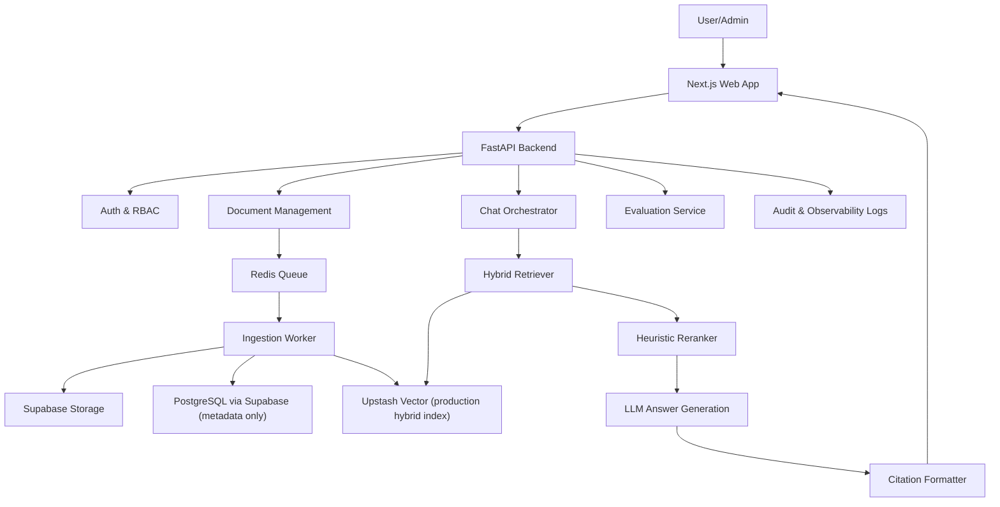
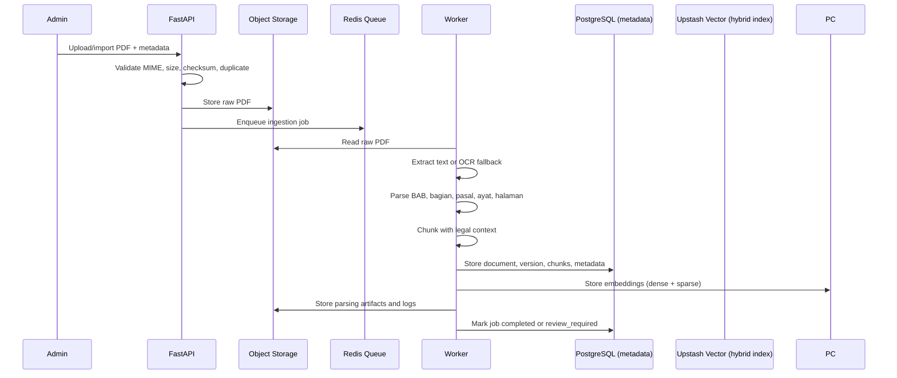
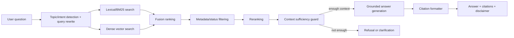

# Architecture Design

Dokumen ini menetapkan desain arsitektur awal KerjaPedia AI untuk MVP. Detail implementasi dapat berubah, tetapi kontrak utama seperti alur data, role, citation, storage, dan refusal harus tetap dipertahankan.

## System Overview



Primary apps:

- `apps/web`: Next.js frontend for chat, source viewer, search, and admin UI.
- `apps/api`: FastAPI backend for auth, chat, documents, ingestion jobs, evaluation, and feedback.
- `dataset`: source PDFs and `metadata.json`.
- `compose.yaml`: local Redis (PostgreSQL/object storage via Supabase).

### Vector Store Architecture

**Production Vector Store: Upstash Vector (HYBRID)**
- Dense `open-ai/text-embedding-3-small` + sparse BM25, hosted server-side
- Raw text upsert/query; application performs no local embedding
- Namespace per environment (`production`, `staging`, `evaluation`)

**Metadata Database: PostgreSQL**
- Document metadata, versions, chunks
- JSONB embeddings (backup/reference only)
- pgvector extension enabled but NOT used for production vector search

> **Note:** pgvector is enabled in the database schema but embeddings are stored as JSONB, not vector columns. Upstash Vector is the sole production vector store for similarity search. See [P3-2_PGVECTOR_AUDIT.md](P3_2_PGVECTOR_AUDIT.md) for details. (Pinecone + self-hosted BGE-M3 were retired 2026-09.)

## Ingestion Flow



Ingestion statuses: `queued`, `validating`, `stored`, `parsing`, `ocr`, `chunking`, `embedding`, `indexing`, `review_required`, `completed`, `failed`.

## Retrieval and Answer Flow



Retrieval must prefer active/current documents, but historical documents can be included when needed for comparison or amendment context.

## Authentication and Roles

Use session or token-based auth, with role-based access enforced in FastAPI dependencies and mirrored in frontend route guards.

| Role | Access |
|---|---|
| Guest | Ask public questions, view public citations, view disclaimer/legal pages. |
| User | Guest access plus conversation history, feedback, saved chats, profile settings. |
| Admin | User access plus upload documents, edit metadata, run ingestion, review parsing, manage relationships, view logs, run evaluations. |

Admin routes must be protected server-side. Frontend hiding is not sufficient.

## Database Schema

Initial relational tables:

- `users`: user account and profile data.
- `roles`, `user_roles`: RBAC assignments.
- `documents`: stable regulation identity.
- `document_versions`: file version, checksum, source URL, legal status, ingestion state.
- `document_topics`: normalized topics per document.
- `document_relationships`: amendment, revocation, implementation, and related links.
- `chunks`: parsed legal chunks with article, paragraph, page, text, token count.
- `chunk_embeddings`: pgvector embeddings and retrieval payload fields.
- `ingestion_jobs`: async job status, retries, error messages, timing.
- `conversations`, `messages`: chat history.
- `message_citations`: citations attached to generated answers.
- `feedback`: helpful/not helpful and issue categories.
- `prompt_versions`: versioned system/developer prompt templates.
- `query_logs`: query, rewritten query, retrieval/rerank scores, model, latency, tokens.
- `evaluation_datasets`, `evaluation_questions`, `evaluation_runs`, `evaluation_results`.
- `audit_logs`: admin and system changes.

Vector fields live in PostgreSQL with pgvector for MVP. If retrieval scale outgrows PostgreSQL, `chunk_embeddings` can be moved to Qdrant without changing document/chunk IDs.

## Object Storage Layout

Use MinIO locally and S3-compatible storage in production.

```text
kerjapedia/
  raw/{document_id}/{version}/source.pdf
  interim/{document_id}/{version}/extracted_text.json
  processed/{document_id}/{version}/chunks.json
  ocr/{document_id}/{version}/
  logs/{ingestion_job_id}.json
  evaluation/{evaluation_run_id}/report.json
```

The database stores object keys, not binary files. Checksums are computed before storage and reused for duplicate detection.

## Citation Format

Backend responses should expose citations as structured data:

```json
{
  "citation_id": "msg_001_cit_001",
  "document_id": "PP-35-2021",
  "document_title": "Peraturan Pemerintah Nomor 35 Tahun 2021",
  "short_title": "PP 35/2021",
  "legal_status": "needs_verification",
  "chapter": "BAB II",
  "section": "Perjanjian Kerja Waktu Tertentu",
  "article": "Pasal 15",
  "paragraph": "Ayat (1)",
  "page_start": 12,
  "page_end": 12,
  "quote": "Kutipan pendukung dari dokumen.",
  "source_url": "https://peraturan.bpk.go.id/...",
  "local_file": "dataset/...",
  "retrieval_score": 0.82,
  "rerank_score": 0.91
}
```

UI may hide internal scores from normal users, but scores must remain available for admin debugging and evaluation.

## Prompt Versioning and Audit Log

Every generated answer must store:

- `prompt_version_id`
- model name and model version when available
- user query and rewritten query
- retrieved chunk IDs
- retrieval and rerank scores
- final context sent to the model
- generated answer
- citations
- refusal or clarification reason, if any
- latency, token usage, and estimated cost

Prompt changes must create a new `prompt_versions` row and an `audit_logs` event. Never overwrite prompt text in place.

## Refusal and Clarification Strategy

The system refuses or asks clarification when:

- no retrieved chunk passes the minimum score threshold
- the question is outside Indonesian employment regulation
- the user asks for binding legal advice or a guaranteed legal outcome
- the query is too ambiguous to ground in documents
- retrieved sources conflict and status cannot be resolved
- source status is `needs_verification` for a high-risk answer
- prompt injection or unsafe document instructions are detected

Default refusal shape:

```text
Informasi yang cukup tidak ditemukan dalam dokumen yang tersedia. Silakan perjelas konteks pertanyaan, periksa sumber resmi, atau konsultasikan dengan pihak yang berwenang.
```

Clarification is preferred over refusal when the user likely omitted key facts, such as employment status, contract type, date, or topic.

## Operational Notes

- Document ingestion is asynchronous and idempotent by checksum.
- Chat API must support streaming responses.
- Retrieval must be status-aware and citation-grounded before generation.
- All legal claims require citations or refusal.
- Admin metadata verification is required before production claims about whether a rule is active, amended, or revoked.
