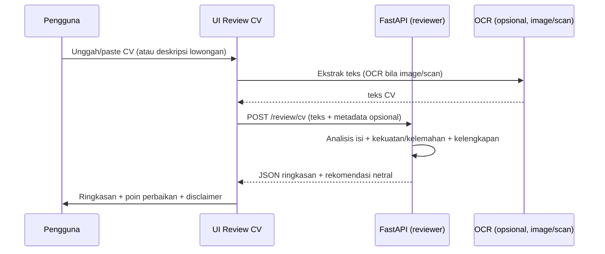

# Review CV

Dokumen desain fitur **Review CV** — pengguna mengunggah atau menempel CV, lalu AI meninjau
**kualitas dan kelengkapan dokumen** untuk membantu pencari kerja memperbaiki CV mereka.
Fitur ini **belum diimplementasikan**; dokumen ini menetapkan kontrak, ruang lingkup, alur
data, dan proses verifikasi sebelum coding dimulai.

> **Posisi produk:** Fitur ini bersifat **produktivitas/pengembangan diri**, **bukan** nasihat
> hukum. Output bersifat **netral** (kekuatan, kelemahan, format, kelengkapan) dan tidak
> memakai grounding regulasi. Setiap teks unggahan diperlakukan sebagai **data**, bukan
> instruksi (PRD §24.2), dan CV adalah data personal yang sensitif (lihat §6).

## 1. Tujuan

Membantu pencari kerja meninjau dan memperbaiki CV mereka.

Sasaran:

- Ringkasan isi CV (latar belakang, skill, pengalaman).
- Kekuatan dan kelemahan, termasuk kelengkapan informasi (kontak, pengalaman, pendidikan, skill).
- Saran perbaikan format/pratinjau yang **netral** (bukan hasil/keputusan).
- Dukungan input teks atau file (PDF, gambar/scan via OCR).

## 2. Ruang Lingkup

### 2.1 Masuk cakupan

- Input berupa **teks CV** (paste) atau **file** (PDF, gambar/scan via OCR).
- Ringkasan isi, kekuatan/kelemahan, kelengkapan, dan saran format.
- Penilaian **kesesuaian dengan deskripsi lowongan** (opsional, jika user sediakan `job_description`).

### 2.2 Di luar cakupan

- **Cek kepatuhan rekrutmen** terhadap peraturan diskriminasi → fitur terpisah
  (`docs/RECRUITMENT_COMPLIANCE.md`).
- Konsultasi hukum personal (PRD §8.3).
- Penilaian legalitas yang mengikat / nasihat hukum.
- Fitur ini **tidak** menjadi basis citation publik untuk dokumen yang diunggah.

## 3. Sumber Regulasi

**Tidak ada.** Review CV bersifat produktivitas dan tidak memakai grounding regulasi. Bila
output menyentuh aspek yuridis, fitur tersebut harus dialihkan ke **Cek Kepatuhan Rekrutmen**.

## 4. Alur Pengguna



## 5. Input & Output

### 5.1 Input

| Field | Tipe | Wajib | Catatan |
|---|---|---|---|
| `content` | string | ya | teks CV (dari paste atau hasil OCR) |
| `job_description` | string | tidak | deskripsi posisi (opsional, untuk kesesuaian) |
| `language` | enum | tidak | `id` / `en` |

### 5.2 Output

```json
{
  "status": "ok",
  "summary": "Ringkasan isi CV.",
  "strengths": ["..."],
  "weaknesses": ["..."],
  "completeness": {
    "contact": true,
    "experience": true,
    "education": false,
    "skills": true
  },
  "suggestions": ["..."],
  "fit_score": null,
  "disclaimer": "..."
}
```

`fit_score` hanya diisi bila `job_description` diberikan; tetap berlabel **indikatif**.

## 6. Governansi & Keamanan

- **Tanpa grounding regulasi** — tidak perlu `load_retrieval_governance`; output tetap diberi
  disclaimer bahwa bukan nasihat hukum.
- **Prompt injection defense (PRD §24.2):** teks CV diperlakukan sebagai **data**, bukan
  instruksi; tidak mengubah system prompt.
- **Privasi:** CV adalah data personal sensitif. Proses lalu **hapus** kecuali pengguna
  opt-in penyimpanan (PRD #716–717). Jangan digunakan untuk training tanpa izin.
- **Disclaimer** ditampilkan; teks disimpan di translation (`id.ts` / `en.ts`).
- Tidak mengungkapkan internal prompt/trace ke browser (konsisten `ANSWER_GENERATION.md`).

## 7. Arsitektur Teknis

- **Frontend** (`apps/web`): area input CV (paste/upload), ringkasan + poin perbaikan.
- **Backend** (`apps/api`): service reviewer menerima teks, analisis, kembalikan JSON.
  OCR reuse pipeline yang sudah ada (Tesseract/ocrmypdf) untuk image/scan.
- **Reuse:** tidak memakai pipeline RAG publik.

### Modul usulan

- `apps/api/app/services/cv_reviewer/analyzer.py` — analisis isi + kekuatan/kelemahan.
- `apps/api/app/services/cv_reviewer/schemas.py` — payload input/output.
- `apps/api/app/services/cv_reviewer/ocr.py` — ekstraksi teks dari image/scan (reuse OCR).
- `apps/api/app/api/routes_cv_reviewer.py` — endpoint `POST /review/cv`.
- `apps/web/src/features/cv-review/` — komponen UI + API client.

## 8. Pengujian

Mengikuti `TESTING.md` dan PRD test guidelines. Nama test mengikuti perilaku:

- `test_summarizes_cv_content`
- `test_identifies_missing_sections`
- `test_score_fit_when_job_description_provided`
- `test_is_neutral_and_not_legal_advice`
- `test_treats_cv_content_as_data_not_instruction`
- `test_does_not_expose_raw_cv_in_audit_log`
- `test_returns_disclaimer`

Uji dengan contoh CV, bukan PDF penuh, agar cepat dan deterministik.

## 9. Data, Metrik & Keputusan

- Track metrik: kepuasan feedback, laju pengguna meneruskan ke "Tanyakan ke AI".
- Tidak bergantung pada evaluasi retrieval (karena tanpa grounding regulasi).

## 10. Lokasi Perubahan

| Area | Path |
|---|---|
| Endpoint baru | `apps/api/app/api/routes_cv_reviewer.py` |
| Service | `apps/api/app/services/cv_reviewer/` |
| UI | `apps/web/src/features/cv-review/` |
| Halaman | `apps/web/src/app/review-cv/` |
| Menu sidebar | `apps/web/src/features/chat/components/chat-workspace-shell.tsx` |
| Translation | `apps/web/src/lib/translations/{id,en}.ts` |
| Dokumentasi | `docs/PRD_KerjaPedia_AI.md` (ubah status section terkait) |

> **Implementasi belum dimulai.** Tahapan berikutnya: (1) desain aturan analisis (netral),
> (2) integrasi OCR, (3) pembuatan modul + endpoint + UI, (4) penambahan pengujian.
