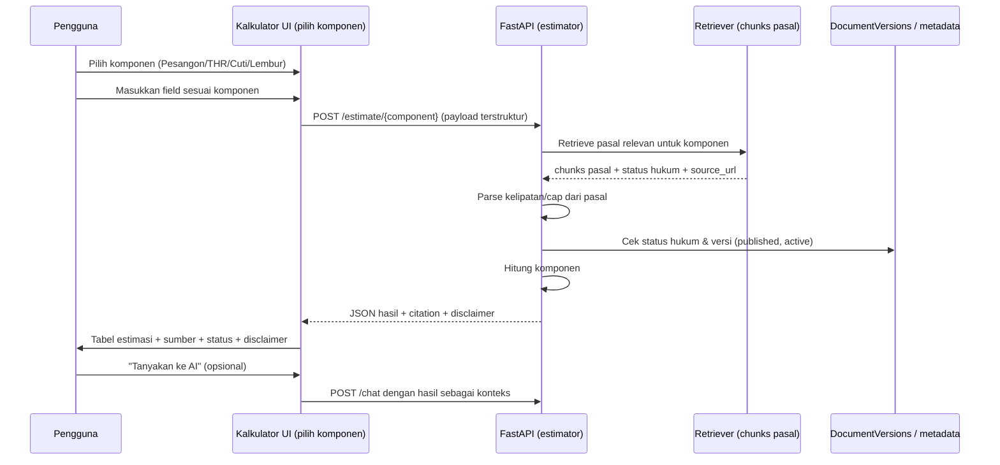

# Kalkulator Ketenagakerjaan (Estimator)

Dokumen desain fitur **Kalkulator Ketenagakerjaan** — satu kalkulator terpadu untuk
estimas indikatif hak/hak pekerja pada **empat komponen**: **Pesangon**, **THR**, **Cuti**,
dan **Upah Lembur**. Fitur ini **belum diimplementasikan**; dokumen ini menetapkan kontrak,
ruang lingkup, alur data, dan proses verifikasi sebelum coding dimulai.

> **Status posisi produk:** PRD §8.3 menandai *"Perhitungan otomatis pesangon yang bersifat
> final"* sebagai di luar MVP. Karena itu fitur ini harus diposisikan sebagai **estimator
> indikatif + disclaimer hukum**, bukan hasil yang final/mengikat. Desain mengikuti prinsip
> Legal Safety §24.1: selalu tampilkan disclaimer, jangan menyebut jawaban sebagai keputusan
> hukum, jangan menjamin hasil perselisihan, dan sarankan verifikasi ke sumber resmi pada
> persoalan berisiko tinggi.

## 1. Tujuan

Memberikan estimasi indikatif hak/hak pekerja pada topik pengupahan dan PHK, dan mengarahkan
pengguna ke dasar hukumnya, tanpa menggantikan konsultasi atau keputusan hukum.

Sasaran:

- Satu titik akses untuk empat komponen: **Pesangon** (UP + UPMK + UPH), **THR**, **Cuti**,
  dan **Upah Lembur**.
- Setiap angka **grounded** pada pasal yang ter-retrieve, bukan angka hardcode.
- Menyertakan **status hukum** dan **tautan sumber resmi** untuk verifikasi.
- Menawarkan lanjut ke chat untuk penjelasan atau verifikasi tambahan.

## 2. Ruang Lingkup

### 2.1 Masuk cakupan

- Empat komponen: Pesangon, THR, Cuti, Upah Lembur.
- Perhitungan berbasis masukan terstruktur (masa kerja, upah, jam kerja, durasi cuti, dsb.).
- Menampilkan dasar pasal + link sumber + status hukum.
- Tombol "Tanyakan ke AI" yang mengirim hasil sebagai konteks ke chat.

### 2.2 Di luar cakupan

- Perhitungan otomatis yang bersifat **final/binding** (PRD §8.3).
- Sengketa PHK yang harus diputus pengadilan/hubungan industrial.
- Komponen yang memerlukan verifikasi kasuistik (mis. bukti pelanggaran berat, kondisi
  perusahaan) — hanya diestimasi dan diberi peringatan.
- Peraturan daerah, putusan MA/MK, dan kasus yang tidak ada di dataset (PRD §8.3).
- Komponen lain di luar empat di atas (mis. BPJS, JKP, pajak) — dapat menjadi iterasi berikutnya.

## 3. Sumber Regulasi

Dokumen yang menjadi dasar kalkulasi, dikunci ke sumber resmi (`https://*.go.id`):

| Komponen | Dokumen utama | Peran | Lokasi dataset |
|---|---|---|---|
| Pesangon | PP 35/2021 | Rumus pesangon & kompensasi | `Dasar ketenagakerjaan, PKWT, PHK, dan alih daya/PP Nomor 35 Tahun 2021.pdf` |
| Pesangon | UU 6/2023 | Amendemen & status berlaku | `Dasar ketenagakerjaan, PKWT, PHK, dan alih daya/UU Nomor 6 Tahun 2023.pdf` |
| Pesangon | UU 13/2003 | Kerangka awal ketenagakerjaan | `Dasar ketenagakerjaan, PKWT, PHK, dan alih daya/UU Nomor 13 Tahun 2003.pdf` |
| THR | Permenaker (Kemnaker) 6/2016 | Dawah & besaran THR | `Pengupahan dan THR/Kemnaker No. 6 Tahun 2016.pdf` |
| Upah Lembur | UU 13/2003 / PP 35/2021 | Perhitungan lembur | `Dasar ketenagakerjaan, PKWT, PHK, dan alih daya/...` |
| Cuti | UU 13/2003 / PP 35/2021 | Hak cuti (tahunan, dsb.) | `Dasar ketenagakerjaan, PKWT, PHK, dan alih daya/...` |
| Upah Minimum (referensi) | PP 36/2021 | Batas upah minimum (opsional) | `Pengupahan dan THR/PP Nomor 36 Tahun 2021.pdf` |
| Upah Minimum (referensi) | PP 49/2025 | Pembaruan upah minimum (opsional) | `Pengupahan dan THR/PP Nomor 49 Tahun 2025.pdf` |

**Kunci desain:** kalkulator **tidak meng-hardcode** kelipatan/rumus. Ia harus membaca pasal
dari dokumen ter-retrieve agar konsisten dengan proposisi nilai PRD #1-2 (jawaban hanya dari
dokumen yang diretriever, citation sampai level pasal/ayat/halaman). Bila pasal untuk suatu
komponen tidak ter-retrieve, kalkulator menolak menghitung komponen tersebut (fail-closed)
alih-alih memakai angka default.

## 4. Alur Pengguna



Karena satu halaman, UI menampilkan pilihan komponen (tab/dropdown) dan hanya menampilkan
field yang relevan untuk komponen yang dipilih.

## 5. Input & Output

### 5.1 Input

Struktur payload umum, dengan field khusus per komponen:

| Field | Tipe | Komponen | Wajib | Catatan |
|---|---|---|---|---|
| `component` | enum | semua | ya | `pesangon` / `thr` / `cuti` / `lembur` |
| `termination_type` | enum | pesangon | ya | efisiensi, pelanggaran_berat, pensiun, meninggal, dll. |
| `contract_type` | enum | pesangon, thr | ya | `PKWTT` / `PKWT` |
| `service_years` / `service_months` | int | pesangon | ya | masa kerja penuh |
| `wage` | number | semua | ya | upah pokok + tunjangan tetap |
| `tenure` | enum | thr | ya | lamanya bekerja (mis. >= 12 bulan, 1-12 bulan) |
| `leave_years` | int | cuti | ya | periode hak |
| `overtime_hours` | number | lembur | ya | total jam lembur |
| `overtime_type` | enum | lembur | ya | hari kerja / hari libur |
| `reason` | string | semua | tidak | deskripsi bebas (opsional, untuk verifikasi) |

### 5.2 Output

```json
{
  "status": "ok",
  "component": "pesangon",
  "estimates": {
    "up": { "amount": null, "months": null, "basis": "PP 35/2021" },
    "upmk": { "amount": null, "months": null, "basis": "PP 35/2021" },
    "uph": { "amount": null, "basis": "PP 35/2021" },
    "total": null
  },
  "citations": [
    {
      "document_id": "PP-35-2021",
      "article": "Pasal ...",
      "page_start": 0,
      "page_end": 0,
      "quote": "...",
      "source_url": "https://peraturan.bpk.go.id/Details/161904",
      "legal_status": "active"
    }
  ],
  "disclaimer": "...",
  "insufficient_sources": false
}
```

Untuk `thr`/`cuti`/`lembur`, `estimates` berisi field yang relevan (mis. `thr_amount`,
`leave_days`, `overtime_amount`). Bila pasal tidak ter-retrieve atau status tidak memenuhi
governance, respons berisi `insufficient_sources: true` dan **tanpa** angka untuk komponen
tersebut, disertai ajakan memverifikasi ke sumber resmi.

## 6. Aturan Governansi & Keamanan

- Hanya dokumen yang lolos `load_retrieval_governance` (published, verified, completed,
  `active`/`amended`, URL `.go.id`) yang boleh jadi basis kalkulasi. Admin tidak
  memengaruhi estimasi publik.
- Gunakan `legal_status` dan `source_url` dari `DocumentVersion` untuk tiap citation.
- Disclaimer wajib ditampilkan; teks disimpan di translation (`id.ts` / `en.ts`) dan data.
- Tidak mengungkapkan internal prompt/trace ke browser (konsisten `ANSWER_GENERATION.md`).
- Log audit mencatat request estimasi (tanpa data pribadi sensitif bila memungkinkan).

## 7. Arsitektur Teknis

- **Frontend** (`apps/web`): satu halaman kalkulator dengan pemilih komponen (tab/dropdown).
  Halaman dipanggil dari menu sidebar chat. Tabel hasil mengikuti pola `DocumentSummary`
  existing. Setiap komponen memakai form field yang relevan.
- **Backend** (`apps/api`): service estimator yang menerima payload terstruktur, retrieve
  pasal via retriever, hitung komponen, dan kembalikan JSON + citation. Satu endpoint dengan
  pola `POST /estimate/{component}` yang memilih sub-kalkulator berdasarkan `component`.
- **Reuse:** memakai `visible_chunks`/`load_artifact_documents` dan governance yang sudah ada;
  tidak mengintroduksi pipeline RAG baru.

### Modul usulan

- `apps/api/app/services/kalkulator/` — sub-modul `pesangon.py`, `thr.py`, `cuti.py`,
  `lembur.py`, masing-masing parsing pasal + kalkulasi.
- `apps/api/app/services/kalkulator/schemas.py` — payload input/output terpadu.
- `apps/api/app/api/routes_kalkulator.py` — endpoint `POST /estimate/{component}`.
- `apps/web/src/features/kalkulator/` — komponen UI + API client (pemilih komponen + form).

## 8. Pengujian

Mengikuti `TESTING.md` dan PRD test guidelines. Nama test mengikuti perilaku:

Pesangon:

- `test_estimates_up_for_efisiensi`
- `test_estimates_upmk_by_service_years`
- `test_estimates_uph_leave_and_benefits`

Per komponen lain:

- `test_estimates_thr_for_12_month_tenure`
- `test_estimates_thr_proportional_for_partial_tenure`
- `test_estimates_cuti_yearly_entitlement`
- `test_estimates_lembur_weekday_and_holiday`
- `test_refuses_component_when_pasal_not_retrieved`
- `test_excludes_revoked_document_from_estimate`
- `test_uses_active_version_only`
- `test_returns_disclaimer_and_citation`

Uji dengan **excerpt kecil** dari dokumen sumber, bukan PDF penuh, agar cepat dan deterministik.

## 9. Data, Metrik & Keputusan

- Tambahkan contoh kasus ke dataset evaluasi (PRD bab 23) untuk retrieval pasal tiap komponen.
- Track metrik: tingkat `insufficient_sources`, ketepatan estimasi atas kasus uji, dan
  apakah pengguna meneruskan ke chat, per komponen.
- Bila akurasi retrieval pasal rendah untuk suatu komponen, evaluasi ulang chunking dokumen
  terkait sebelum rilis.

## 10. Lokasi Perubahan

| Area | Path |
|---|---|
| Endpoint baru | `apps/api/app/api/routes_kalkulator.py` |
| Service | `apps/api/app/services/kalkulator/` |
| UI | `apps/web/src/features/kalkulator/` |
| Halaman | `apps/web/src/app/kalkulator/` |
| Menu sidebar | `apps/web/src/features/chat/components/chat-workspace-shell.tsx` |
| Translation | `apps/web/src/lib/translations/{id,en}.ts` |
| Dokumentasi | `docs/PRD_KerjaPedia_AI.md` (ubah status section terkait) |

> **Implementasi belum dimulai.** Tahapan berikutnya: (1) konfirmasi rumus kelipatan &
> kondisi dari pasal PP 35/2021, Permenaker 6/2016, dan UU 13/2003/PP 35/2021,
> (2) audit evaluasi retrieval pasal per komponen, (3) pembuatan modul + endpoint + UI,
> (4) penambahan pengujian.
