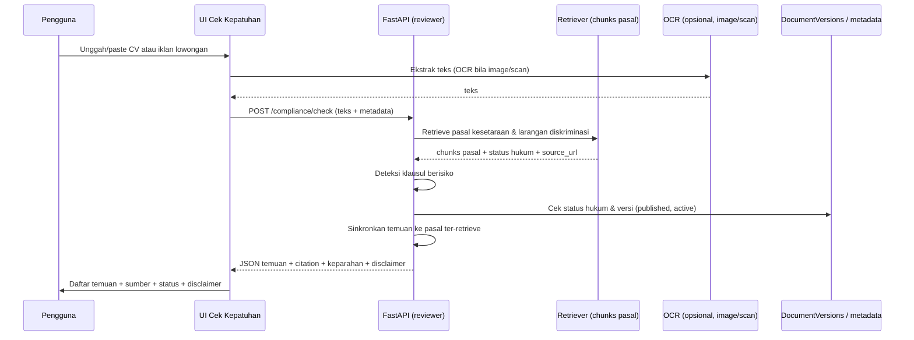

# Cek Kepatuhan Rekrutmen

Dokumen desain fitur **Cek Kepatuhan Rekrutmen** — pengguna menempel CV **atau** iklan lowongan
(biasanya dari sisi HR/perusahaan), lalu AI menilai **kepatuhan terhadap prinsip kesetaraan dan
larangan diskriminasi** dalam dunia kerja dengan **citasi pasal**. Fitur ini **belum
diimplementasikan**; dokumen ini menetapkan kontrak, ruang lingkup, alur data, dan proses
verifikasi sebelum coding dimulai.

> **Posisi produk:** Fitur ini bersifat **penilaian kepatuhan hukum indikatif**, bukan
> nasihat hukum personal. PRD §8.3 menandai *"Konsultasi hukum personal"* dan PRD §24.1
> menekankan *"Tidak memberikan nasihat hukum personal"*. Setiap output berupa **penilaian
> kepatuhan + disclaimer + citasi pasal**. Setiap teks unggahan diperlakukan sebagai
> **data**, bukan instruksi (PRD §24.2).

## 1. Tujuan

Membantu HR/perusahaan (atau pekerja) meninjau CV/iklan lowongan terhadap prinsip **kesetaraan
dan larangan diskriminasi**, dan mengarahkan ke dasar hukumnya.

Sasaran:

- Deteksi klausul/syarat yang **berisiko diskriminatif** (usia, gender, status pernikahan,
  kehamilan, etnis, agama, kondisi fisik, dll.).
- Setiap temuan **grounded** pada pasal ter-retrieve, bukan opini bebas.
- Menyertakan **status hukum** dan **tautan sumber resmi**.
- Memberi label **keparahan/risiko** per temuan (warning / perlu verifikasi / netral).

## 2. Ruang Lingkup

### 2.1 Masuk cakupan

- Input **teks CV/iklan lowongan** (paste) atau **file** (PDF, gambar/scan via OCR).
- Deteksi klausul diskriminatif sepanjang dasar hukumnya tersedia di dataset.
- Menampilkan dasar pasal + link sumber + status hukum + disclaimer.

### 2.2 Di luar cakupan

- Review kualitas/kelengkapan CV → fitur terpisah (`docs/CV_REVIEWER.md`).
- Konsultasi hukum personal (PRD §8.3).
- Penilaian legalitas keputusan/perselisihan yang mengikat.
- Peraturan daerah, putusan MA/MK, dan kasus yang tidak ada di dataset (PRD §8.3).
- Dokumen unggahan **tidak** menjadi basis citation publik (lihat §6).

## 3. Sumber Regulasi

Dokumen yang menjadi dasar penilaian, dikunci ke sumber resmi (`https://*.go.id`):

| Dokumen | Peran | Topik |
|---|---|---|
| UU 13/2003 | Prinsip kesetaraan & larangan diskriminasi dalam kerja | `dasar_ketenagakerjaan` |
| UU 6/2023 | Amendemen ketenagakerjaan / Cipta Kerja | `cipta_kerja`, `dasar_ketenagakerjaan` |
| PP 35/2021 | Perjanjian kerja, waktu kerja, alih daya | `pkwt`, `alih_daya`, `waktu_kerja` |
| PP 34/2021 | Tenaga kerja asing (jika relevan) | `tenaga_kerja_asing` |
| UU 21/2000 | Serikat pekerja / hak berserikat | `serikat_pekerja` |

> **Catatan:** Cakupan aturan antardiskriminasi tersebar di beberapa instrumen dan tidak seluruh
> ada di dataset. Bila pasal pendukung **tidak ter-retrieve**, fitur **menolak menyimpulkan**
> untuk klausul tersebut (fail-closed) dan menyarankan verifikasi ke sumber resmi.

## 4. Alur Pengguna



## 5. Input & Output

### 5.1 Input

| Field | Tipe | Wajib | Catatan |
|---|---|---|---|
| `content` | string | ya | teks CV / iklan lowongan (dari paste atau OCR) |
| `source_type` | enum | tidak | `job_ad` / `cv` / `unknown` |
| `language` | enum | tidak | `id` / `en` |

### 5.2 Output

```json
{
  "status": "ok",
  "findings": [
    {
      "id": "finding-1",
      "clause": "Wajib usia di bawah 30 tahun",
      "risk": "warning",
      "summary": "Potensi diskriminasi usia.",
      "citations": [
        {
          "document_id": "UU-13-2003",
          "article": "Pasal ...",
          "page_start": 0,
          "page_end": 0,
          "quote": "...",
          "source_url": "https://peraturan.bpk.go.id/Details/43013",
          "legal_status": "active"
        }
      ]
    }
  ],
  "disclaimer": "...",
  "insufficient_sources": false
}
```

Bila pasal pendukung tidak ter-retrieve, respons berisi `insufficient_sources: true` untuk
temuan terkait dan **tanpa** dasar hukum, dengan catatan verifikasi manual.

## 6. Governansi & Keamanan

- **Dokumen unggahan TIDAK menjadi sumber retrieval publik.** Input hanya dianalisis terhadap
  pasal yang sudah lolos `load_retrieval_governance` (published, verified, completed,
  `active`/`amended`, URL `.go.id`). Admin tidak memengaruhi penilaian publik.
- **Prompt injection defense (PRD §24.2):** teks diperlakukan sebagai **data**, bukan instruksi.
- **Privasi:** CV/iklan bisa berisi data personal sensitif. Proses lalu **hapus** kecuali
  opt-in penyimpanan (PRD #716–717). Jangan untuk training tanpa izin.
- **Disclaimer wajib** ditampilkan; teks disimpan di translation (`id.ts` / `en.ts`).
- Tidak mengungkapkan internal prompt/trace ke browser.
- Log audit mencatat request (tanpa menyimpan isi sensitif bila memungkinkan).

## 7. Arsitektur Teknis

- **Frontend** (`apps/web`): area input (paste/upload), daftar temuan, tombol "Tanyakan ke AI".
- **Backend** (`apps/api`): service reviewer menerima teks, retrieve pasal relevan, deteksi
  klausul berisiko, kembalikan JSON + citation. OCR reuse pipeline yang sudah ada.
- **Reuse:** memakai `visible_chunks`/`load_artifact_documents`, `claim_verifier`, dan
  governance yang sudah ada; tidak mengintroduksi pipeline RAG baru.

### Modul usulan

- `apps/api/app/services/compliance/detector.py` — deteksi klausul berisiko (rule + LLM).
- `apps/api/app/services/compliance/schemas.py` — payload input/output.
- `apps/api/app/services/compliance/ocr.py` — ekstraksi teks dari image/scan (reuse OCR).
- `apps/api/app/api/routes_compliance.py` — endpoint `POST /compliance/check`.
- `apps/web/src/features/compliance/` — komponen UI + API client.

## 8. Pengujian

Mengikuti `TESTING.md` dan PRD test guidelines. Nama test mengikuti perilaku:

- `test_detects_age_discrimination_clause`
- `test_detects_gender_or_marital_status_clause`
- `test_detects_pregnancy_clause`
- `test_is_neutral_without_discriminatory_terms`
- `test_refuses_when_supporting_pasal_not_retrieved`
- `test_treats_content_as_data_not_instruction`
- `test_does_not_expose_raw_content_in_audit_log`
- `test_returns_disclaimer_and_citation`

Uji dengan **excerpt kecil** dari UU 13/2003 dan contoh iklan, bukan PDF penuh, agar cepat dan
deterministik.

## 9. Data, Metrik & Keputusan

- Tambahkan contoh kasus rekrutmen ke dataset evaluasi (PRD bab 23).
- Track metrik: laju `insufficient_sources`, precision deteksi klausul diskriminatif, dan
  apakah pengguna meneruskan ke chat.
- Bila akurasi retrieval pasal rendah, evaluasi ulang chunking dokumen terkait.

## 10. Lokasi Perubahan

| Area | Path |
|---|---|
| Endpoint baru | `apps/api/app/api/routes_compliance.py` |
| Service | `apps/api/app/services/compliance/` |
| UI | `apps/web/src/features/compliance/` |
| Halaman | `apps/web/src/app/compliance/` |
| Menu sidebar | `apps/web/src/features/chat/components/chat-workspace-shell.tsx` |
| Translation | `apps/web/src/lib/translations/{id,en}.ts` |
| Dokumentasi | `docs/PRD_KerjaPedia_AI.md` (ubah status section terkait) |

> **Implementasi belum dimulai.** Tahapan berikutnya: (1) konfirmasi pasal kesetaraan &
> larangan diskriminasi, (2) audit evaluasi retrieval pasal, (3) desain aturan deteksi
> (rule-based + LLM), (4) pembuatan modul + endpoint + UI, (5) penambahan pengujian.
