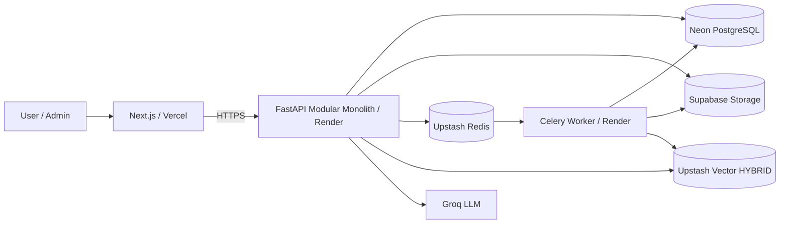

# 01 — System Context (C4 L1)

## Scope
KerjaPedia AI: asisten regulasi ketenagakerjaan Indonesia, RAG citation-grounded,
legally governed, fail-closed. Modular monolith, bukan microservices.

## Data ownership
- Neon PostgreSQL = relational system of record
- Supabase Storage = object/file storage only (private `regulations` bucket)
- Upstash Vector HYBRID = retrieval index only (dense text-embedding-3-small + BM25)
- Upstash Redis = queue/cache/rate-limit (transient)
- Groq = LLM generation + claim verification

