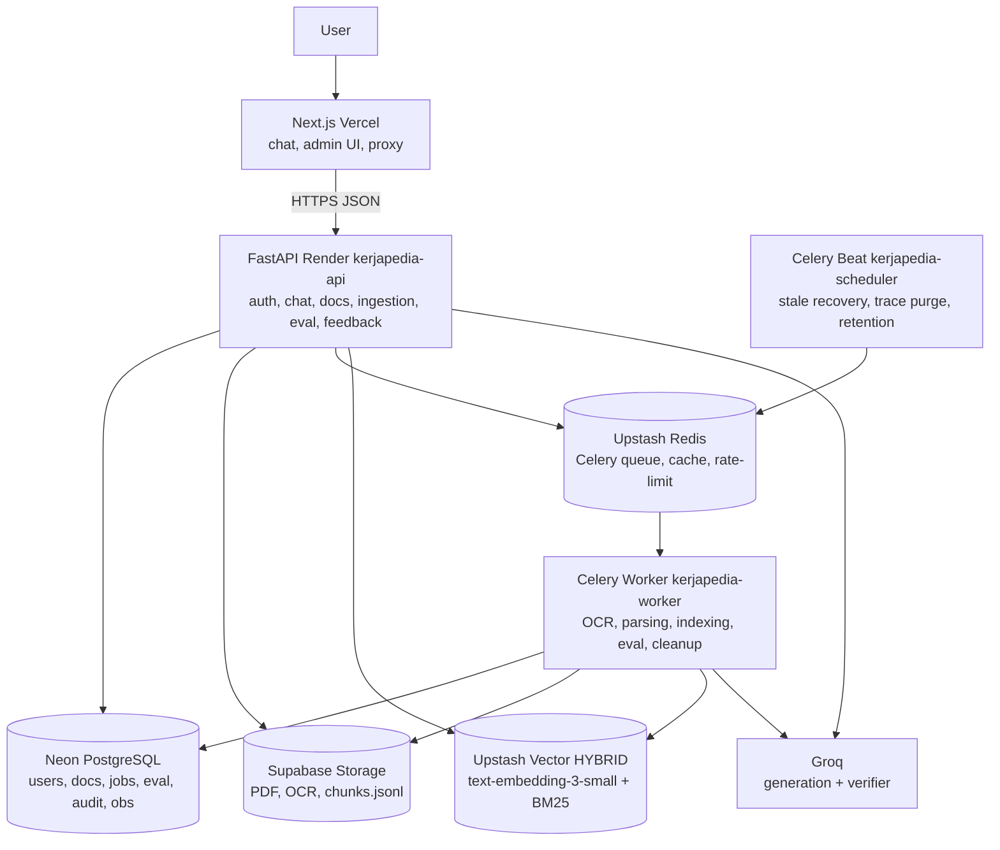

# 02 — Container Architecture (C4 L2)

Deploy: `render.yaml` memiliki `kerjapedia-api` (web), `kerjapedia-worker`
(worker), `kerjapedia-scheduler` (cron). Compose production memuat
`api/worker/scheduler/redis/postgres/migrate/web` dengan parity yang sama.
