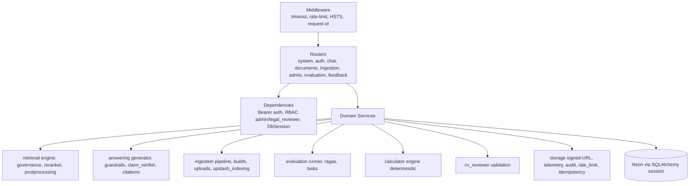

# 03 — Backend Component Design (FastAPI Modular Monolith)

Boundary: `app/api/*` HTTP only; `app/services/*` domain logic; `app/models/*`
Neon schema; `app/db/*` engine/session; `app/core/*` config/logging;
`app/workers/*` Celery entrypoint. Jangan duplikasi implementasi (satu
retrieval engine, satu ingestion pipeline, satu claim verifier).
