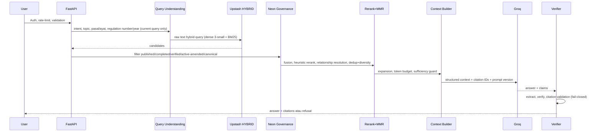

# 04 — RAG Architecture

Hard filter (nomor/tahun/pasal) dari query saat ini; memory hanya soft signal.
Reranker tidak menggantikan hard filter. LLM tidak menentukan sumber sendiri.
Non-stream `/chat/ask` async: retrieval (60s) + generasi (80s) via
`asyncio.to_thread` (isolated session, total 140s di bawah middleware 150s,
504 + `stage` on timeout, outcome `timeout_retrieval`/`timeout_generation`);
stream memakai pola yang sama + heartbeat 15s. Evaluasi berat via Celery
(`kerjapedia.evaluation.run`), bukan BackgroundTasks.
