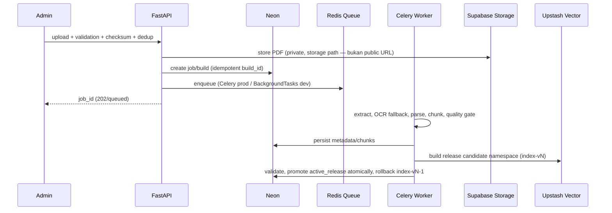

# 05 — Ingestion Architecture

Idempotency: `document_id + source_checksum + pipeline_version`.
`POST /ingestion/jobs/reembed` async by default (`?sync=true` hanya admin kecil)
dan menghormati Neon governance filter.
