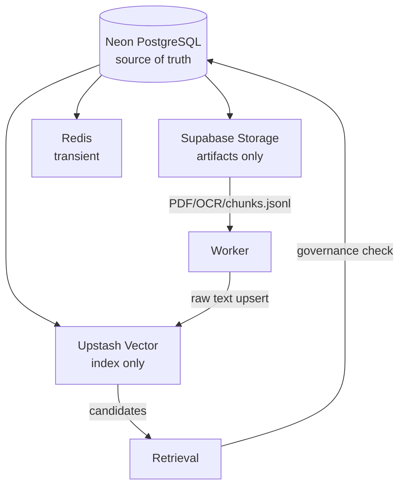

# 06 — Data Architecture & Ownership

Neon: users, `roles` + `user_roles` (normalized, authoritative sejak 0016;
JSONB `user_profiles.roles` tinggal read cache), conversations, messages,
documents, versions, relationships, chunks metadata, jobs/builds, releases,
`prompt_versions` (single-active) + `calculation_rules` (versioned, efektif
bertanggal), eval, feedback, audit, RAG observations, usage. SQLAlchemy +
Alembic only (head `20260923_0016`, murni additive); `pool_pre_ping`,
`pool_recycle=300`; tidak simpan PDF binary. Upstash: chunk/vector ID + raw
text + retrieval metadata minimum. Redis: bukan persistent truth.
Admin list (ingestion jobs, eval runs, audit-logs) paginated
(`limit/offset` + `X-Total-Count`; audit-logs `?page=` kembalikan envelope
`{entries, total}` sesuai UI settings).
