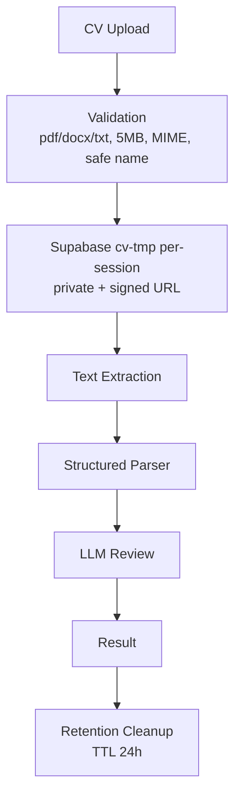

# 08 — CV Reviewer Design

```mermaid
flowchart TD
    U[CV Upload] --> V[Validation<br/>pdf/docx/txt, 5MB, MIME, safe name]
    V --> S[Supabase cv-tmp per-session<br/>private + signed URL]
    S --> E[Text Extraction]
    E --> P[Structured Parser]
    P --> L[LLM Review]
    L --> R[Result]
    R --> D[Retention Cleanup<br/>TTL 24h]
```

Invariant: tidak di-index ke namespace regulasi; tidak log raw CV; path
terpisah `cv-tmp/`; implementasi `app/services/cv_reviewer/service.py`.
