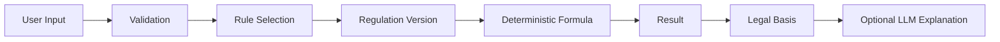

# 09 — Calculator Design (Deterministic)

Implementasi `app/services/calculator/engine.py`: `thr` (PP 36/2021) dan
`pesangon` (PP 35/2021 simplified), versioned + effective date + formula ID.
LLM hanya untuk penjelasan, tidak untuk angka. Unit-tested boundary.
