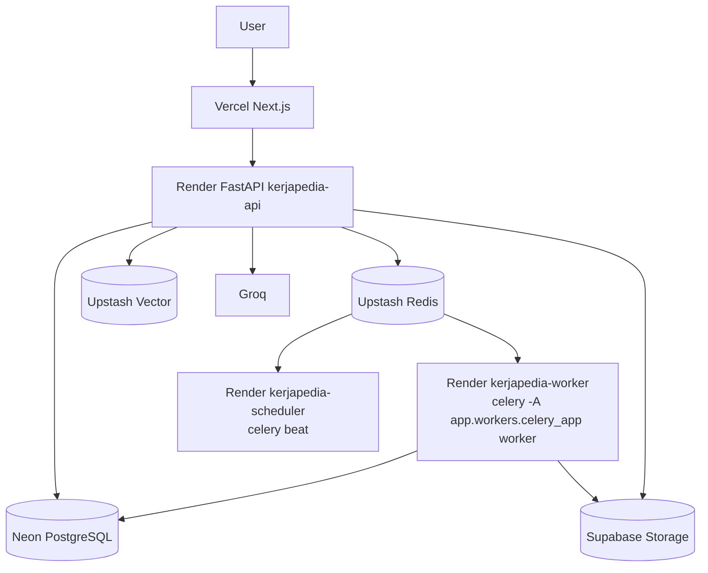

# 10 — Deployment Architecture

Health: `/health` liveness tanpa deps; `/ready` cek Neon + Upstash strict +
Supabase/Redis di prod + active release, cache 10s, 503 bila not-ready.
DB: pooled URL Neon + SSL, `pool_pre_ping`, migrasi `alembic upgrade head`
via `start.sh`/`migrate` service.
