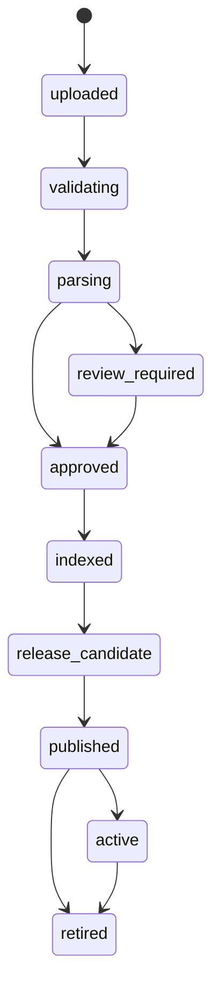

# 14 — Document Lifecycle & Releases

`Document → DocumentVersion → IngestionBuild → IndexRelease → ActiveRelease`.
Index prod immutable per-namespace (`index-v42` dibangun penuh, promosi atomik
via single-active partial unique, rollback ke `index-v41`). Governance:
`publication_status=published`, `ingestion_status=completed`, source/legal
verified, canonical go.id, legal active/amended; historis hanya bila query
eksplisit historis.
