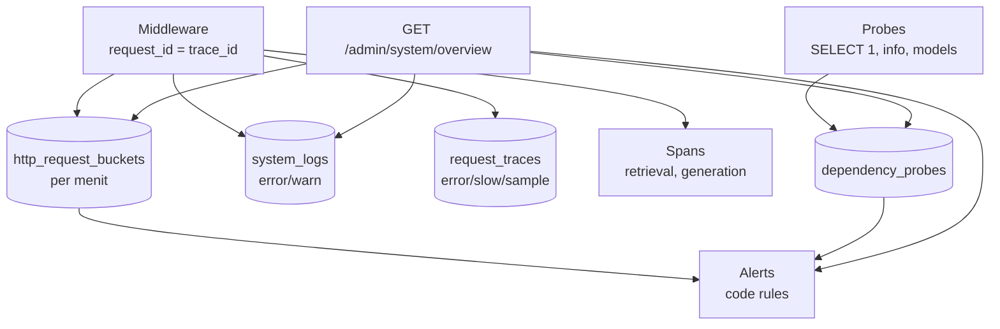

# 15 — System Monitoring (`/admin/system`)

Terpisah dari RAG Observability (`/admin/observability`, `docs/system-design/11-observability.md`):
halaman ini memantau kesehatan aplikasi/API/dependensi, bukan kualitas RAG
(recall, faithfulness, retrieval analysis, token, cost).

## Metrics

`http_request_buckets`: count, error, sum latensi, histogram tetap
(50…15000ms) → avg/p50/p95/p99 tanpa baris per-request. Uptime = umur proses
(reset saat deploy; tidak ada CPU/RAM karena serverless — tidak difabrikasi).

## Logs

Hanya warn/error ke Neon (`system_logs`, retensi 7 hari); info/debug tetap di
stdout. Tidak pernah menyimpan password, key, header auth, cookie, token,
atau prompt mentah.

## Traces

Root span per request + span `retrieval`/`generation` di chat; disimpan bila
error/timeout/lambat (>2 dtk)/5% sampel (retensi 7 hari). Detail RAG
(rerank, konteks, verifier) milik Observability.

## Health

`/health` publik minimal; `/admin/system/services` probe ringan (tanpa LLM
berbayar; Groq hanya `GET /models` di production).

## Alerts

Aturan kode: error>5%/5mnt (critical), p95>3000ms/10mnt (warning),
service down (critical), timeout ≥3/15mnt (warning), 429 ≥20/15mnt
(warning). Event firing/resolved + cooldown 15 mnt; tanpa integrasi
email/Slack palsu.

## Retention & failure safety

Buckets/probe/log/trace 7 hari, alert 30 hari via `kerjapedia.system.cleanup`
harian. Semua writer fail-safe: monitoring gagal → aplikasi tetap jalan.

## Debug insiden

Alert → Metrics (overview) → Service Health → Trace waterfall → Logs
(joined by trace_id) → Root Cause.
